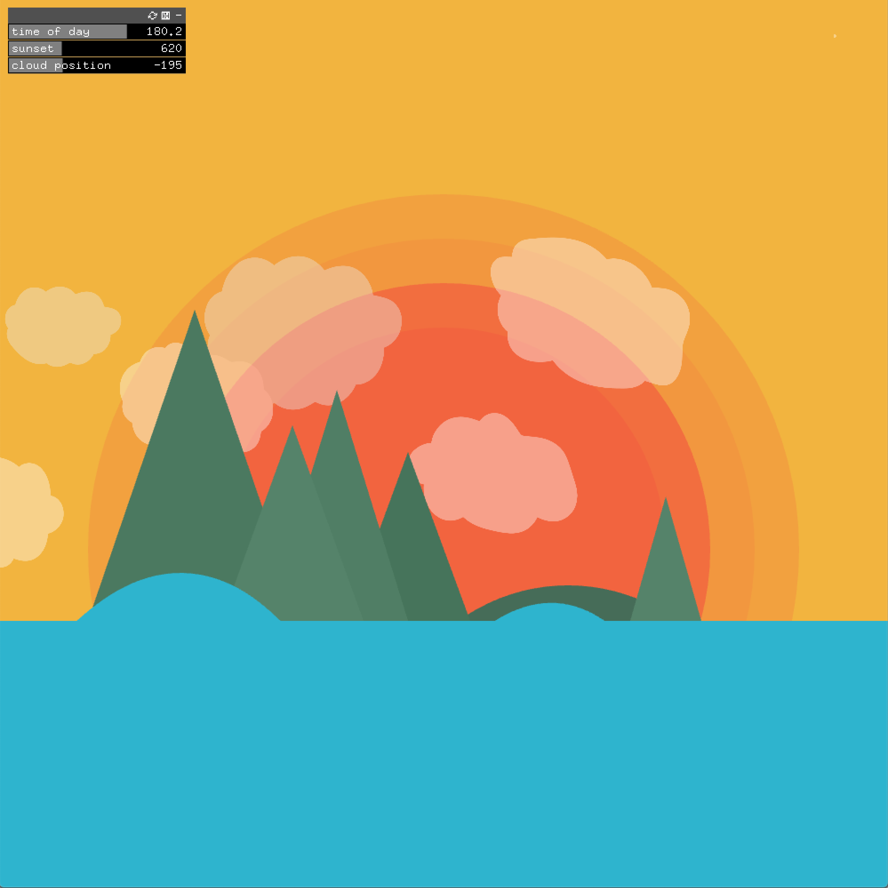
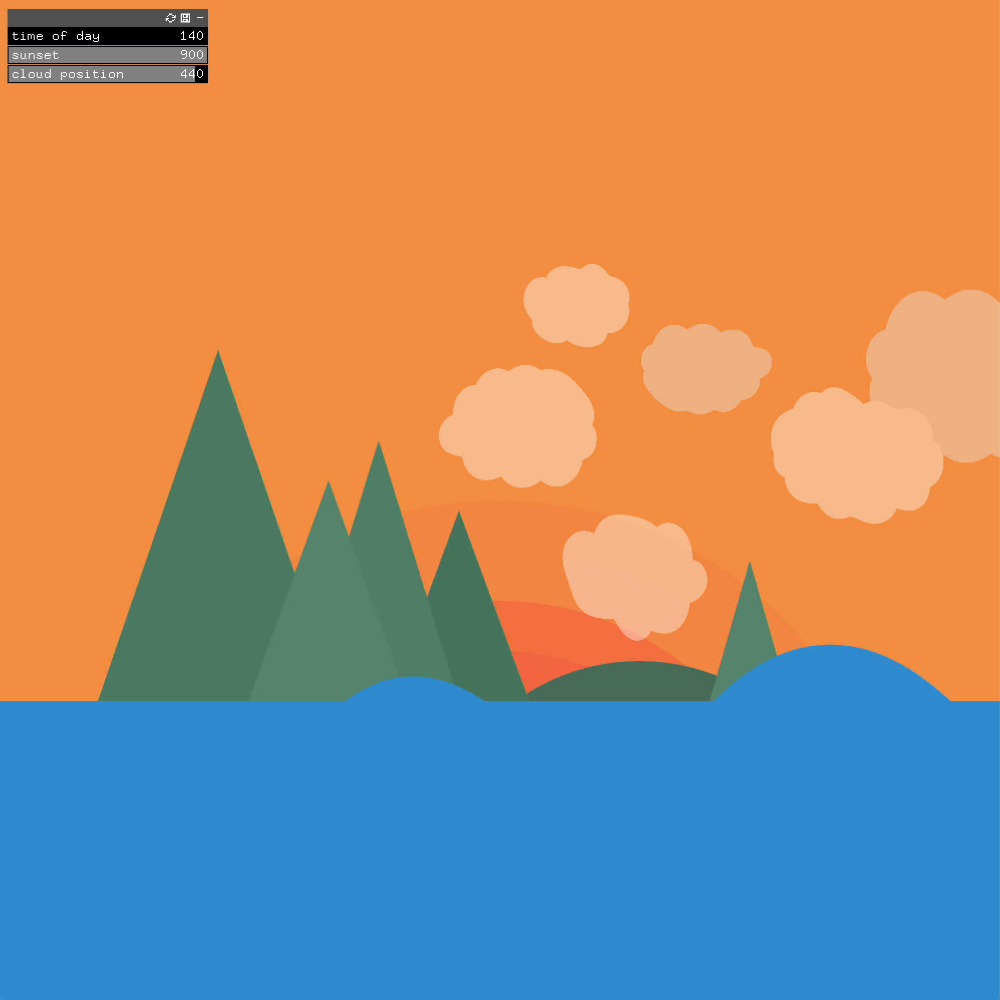

# Sunset Mountains

For this OpenFrameworks assignment, I decided to mimic a sunset in a mountain landscape. My starting point for this assignment was from my previous sketch of mountains (I wanted to develop this further.) I also took a look at some mountain sunset images online for further inspiration.

The composition shows a small range of mountains and an island in the middle of the blue ocean, as well as the sun setting behind them. These elements were created using the draw function (circles, triangles and rectangles), and the clouds were drawn on illustrator and imported as an image. 

I specifically chose the colors to be compliementary (on the color wheel), so that when the "time of day" slider was changed, the colors would still be complimentary and therefore create a contrasting effect. 

The sliders are used to control:
1 - The time of day — changing color values for sky and sea
2 - Position of the clouds — moving along the X axis
3 - Position of the sun — moving along the Y axis

I initially stopped here, however I decided to add some waves in to the ocean, following this tutorial: https://youtu.be/kYejiSrzFzs using sin() to mimic moving waves. 

# Gallery

